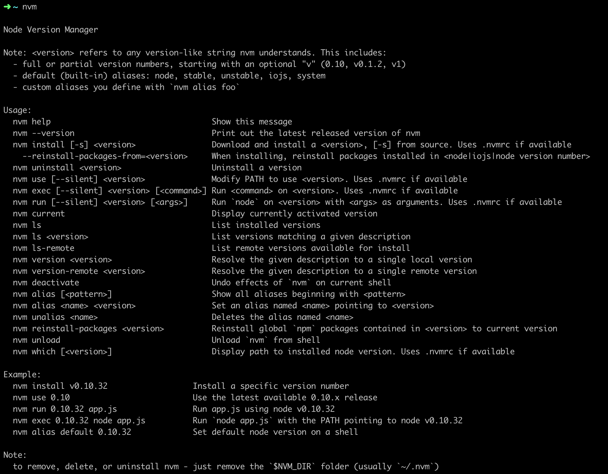

## 一 概述

> 环境信息

笔者环境信息：

OS：macOS Mojave 10.14.6

nvm version：0.29.0


> nvm

nvm是mac下的node管理工具，类似ruby的rvm。


> nvm与n的区别

n命令是作为一个node的模块存在的，n命令更加局限，nvm是一个node/npm的外部shell脚本

使用n命令切换不同的node版本时，实际上会共用全局的node/npm，不能很好的满足按不同的node版本使用不同的全局node模块


## 二 安装nvm

> 删除全局node和npm

若环境上已有全局的node和npm，需要先删除相关的模块。

~~~linux
npm ls -g --depth=0  # 查看已经安装在全局的模块，以便删除这些全局模块后再按照不同的node版本重新进行全局安装
sudo rm -rf /usr/local/lib/node_modules  # 删除全局的node_modules目录
sudo rm -rf /usr/local/bin/node  # 删除全局的node
cd /usr/local/bin && ls -l | grep "../lib/node_modules/" | awk '{print $9}' | xargs rm  # 删除全局node模块注册的软连接
~~~


> 安装nvm

1. 执行命令：`curl -o- https://raw.githubusercontent.com/creationix/nvm/v0.29.0/install.sh | bash`


2. 根据提示重启终端

3. 查看nvm版本，执行成功表明安装成功


## 三 安装node/npm

```linux
nvm install stable       # 安装最新稳定版本
nvm install ${version}   # 安装指定版本，${version}代表版本号
```


## 四 配置node版本

> nvm命令

```linux
nvm use ${version}            # 切换至${version}版本
nvm alias default ${version}  # 设置默认的node版本为${version}
```

> 配置.nvmrc文件

如果默认的node版本与项目所需的版本不同，可在项目根目录或其任意父级目录中创建.nvmrc文件，在文件中指定使用的node版本号

```linux
cd 项目根目录                # 进入项目根目录
echo ${version} > .nvmrc   # 添加版本信息到文件中
nvm use                    # 无需指定版本号，自动使用.nvmrc中配置的版本
node -v                    # 查看node版本是否已切换
```


## 五 nvm常用命令

> 查看可用指令

输入`nvm`查看可用指令




> 禁止或启用nvm

```linux
nvm off    # 禁用node版本管理
nvm on     # 启用node版本管理
```


> 安装、卸载node

```linux
nvm install stable               # 安装最新稳定的node版本
nvm install <version> [arch]     # 安装指定版本（version）和os位数（arch，可选，默认为64位）的node
nvm uninstall <version> [arch]   # 卸载指定版本（version）和os位数（arch，可选，默认为64位）的node
```


> 版本管理

```linux
nvm list 或 nvm ls                # 列出所有安装的node版本
nvm list available                # 列出所有可以安装的node版本
nvm ls-remote                     # 列出所有远程服务器的node版本
nvm current                       # 显示当前的node版本
nvm use <version>                 # 切换使用指定的node版本
nvm alias <name> <version>        # 给不同的版本添加别名
nvm unalias <name>                # 删除已定义的别名
nvm reinstall-packages <version>  # 在当前node版本下，重新安装指定版本的全局npm
```


> 主要常用命令示例


