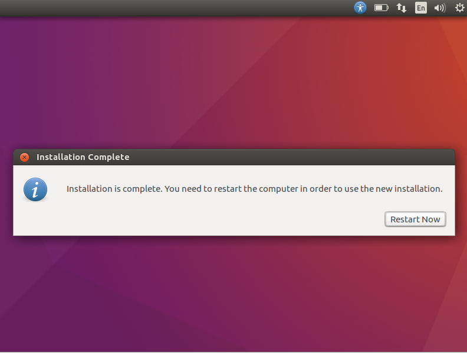
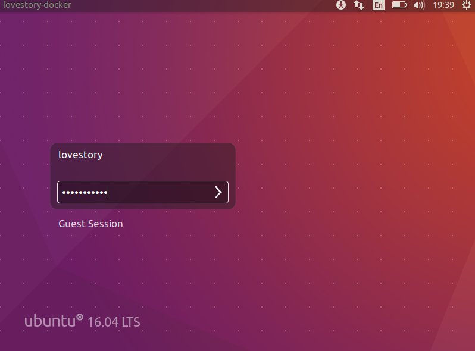

ubuntu操作系统下载：[ubuntu下载](https://www.oschina.net/p/ubuntu)

### 1、准备

> 欢迎界面

选择所要安装的语言，并选择安装

> 准备

可以跳过选项，勾选会影响安装速度

> 选择安装类型

硬盘如何安装ubuntu，虚拟机安装不会清除数据，放心选择

选择安装后需要耐心等待一段时间

### 2、安装

> 时区选择

根据所在时区进行选择

> 键盘布局

选择美式键盘布局

> 设置管理员用户名和密码

根据自己的实际使用情况进行设置

> 等待安装完成

> 重启

安装完成之后，进行重启

> 回车进入

重启后会停留在ubuntu的界面，点击回车（Enter）进入

### 3、使用ubuntu

> 输入用户名和密码

> 开启ubuntu之旅

